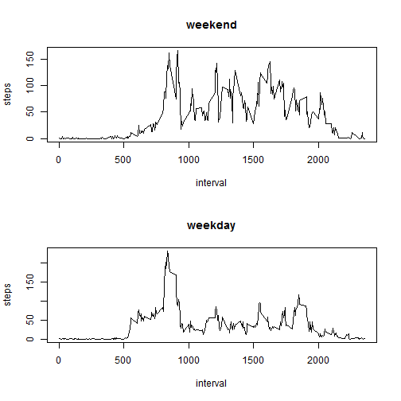

# Assignment 1

## Overview
In this assignment we would be reading data from a csv and create an R markdown file, in which we would plot histograms, time series graphs, calculate mean, impute missing values and plot separate time series graphs for weekends and weekdays. The csv file contains data which has 3 columns, which are as follows:
* Steps
* Date
* Interval

*For all the graphs I have used base plotting system and hence the output graphs might be slightly different from what you might have got in your assignment.*

## Code and outputs

### Reading data
First data from the CSV file is read using read.csv and stored in **data**.
Class of steps and interval is set as numeric and date is stored as Date.

```r
data <- read.csv("activity.csv",colClasses=c("numeric","Date","numeric"))
```

### Plotting histogram
Ignoring missing values of steps, sum of steps for each day is calculated using aggregate function. In aggregate, function sum is passed. Aggregate function ignore NAs. Histogram is then plotted. 

```r
hist(aggregate(steps~date,data,FUN=sum)$steps, xlab="Sum of steps",ylab="Frequency", main="Steps histogram",col="Red")
```

 

### Mean and Median
Mean and median of sum of steps is calculated and displayed.

```r
mean(aggregate(steps~date,data,FUN=sum)$steps)
```

[1] 10766.19

```r
median(aggregate(steps~date,data,FUN=sum)$steps)
```

[1] 10765

### Time series
Time series graph is plotted. In aggregate function, mean is used to calculate mean across every value of interval. Aggregate function ignore NAs.
* x-axis: interval
* y-axis: steps 

```r
plot(aggregate(steps~interval,data,FUN=mean)$interval,aggregate(steps~interval,data,FUN=mean)$steps, type="l",xlab="interval",ylab="steps") 
```

 
### Interval with maximum mean
again aggregate function is used to calculate mean steps for each interval, then interval corresponting to maximum value of mean is displayed.

```r
aggregate(steps~interval,data,FUN=mean)[which(aggregate(steps~interval,data,FUN=sum)$steps == max(aggregate(steps~interval,data,FUN=sum)[,2])),1]
```

[1] 835

### Imputation strategy
There are many rows in which number of steps are not available. So we need to impute them with a value. There are many ways it can be done. Here I have imputed missing values with average number of steps corresponding to that particular interval.


### Imputing NAs
data is first stored in the new variable data2.
A loop is run for all values of interval and NAs are replaced by average value of steps for the interval

```r
data2 <- data
for(i in seq(0,2355,5)) {
data2[which(is.na(data2$steps) & data$interval==i),1] <- mean(data[which(data$interval==i),]$steps,na.rm=TRUE)
}
```
### Plotting new histogram
Histogram is plotted for the new dataset. This time we have a different histogram as NAs have been imputed.

```r
hist(aggregate(steps~date,data2,FUN=sum)$steps, xlab="Sum of steps",ylab="Frequency", main="Steps histogram",col="Red")
```

 
### New Mean and Median, and deviation
Since NAs have been imputed, mean and median of sum of steps for each day would be different. However since we imputed the value with interval means, there might not be a huge deviation.

**New Mean and Median**

```r
mean(aggregate(steps~date,data2,FUN=sum)$steps)
```

[1] 10766.19

```r
median(aggregate(steps~date,data2,FUN=sum)$steps)
```

[1] 10766.19

**Deviation as percentage**

```r
100*(mean(aggregate(steps~date,data2,FUN=sum)$steps)-mean(aggregate(steps~date,data,FUN=sum)$steps))/mean(aggregate(steps~date,data,FUN=sum)$steps)
```

[1] 0

```r
100*(median(aggregate(steps~date,data2,FUN=sum)$steps)-median(aggregate(steps~date,data,FUN=sum)$steps))/median(aggregate(steps~date,data,FUN=sum)$steps)
```

[1] 0.01104207
### Weekday/Weekend factor
A new column is inserted into data2, weektype, which stores whether a day is weekend or a weekday.
For this function weekdays is used, which takes date as the input and returns day of the week. If output is either *Saturday* or *Sunday*, then weekend, otherwise weekday is stored in the new column.

```r
data2$daytype <- as.factor(ifelse(weekdays(data2$date)=="Saturday" | weekdays(data2$date)=="Sunday" , "weekend","weekday"))
```
### 2 panel Time series
Time series plots of mean of number of steps across different intervals is plotted for new data. This time however, separated graphs are plotted for weekday and weekend.
For this first, parameter mfcol, which stores the number of columns, is set. Since we have to plot two graphs, number of columns is set as 2.
Plots for weekend and weekday are plotted one by one.

```r
par(mfcol=c(2,1))
plot(aggregate(steps~interval,data2[which(data2$daytype=="weekend"),],FUN=mean)$interval,aggregate(steps~interval,data2[which(data2$daytype=="weekend"),],FUN=mean)$steps, type="l",xlab="interval",ylab="steps",main="weekend")
plot(aggregate(steps~interval,data2[which(data2$daytype=="weekday"),],FUN=mean)$interval,aggregate(steps~interval,data2[which(data2$daytype=="weekday"),],FUN=mean)$steps, type="l",xlab="interval",ylab="steps",main="weekday")
```

 

This concludes the assignment. Please be generous while grading the assignmnet.
